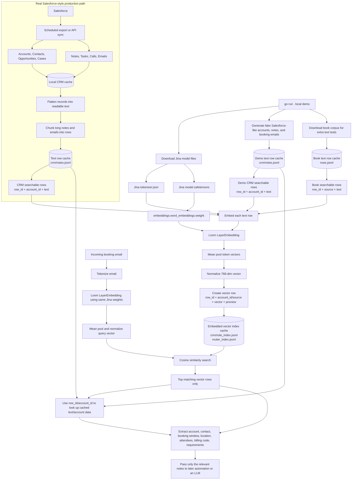
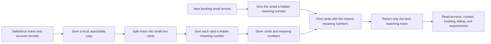

# Jina RAG Rows TVA Experiment

This folder is a local experiment for testing whether Loom can route text to the
right records before an LLM answers. Think of it like a tiny RAG lab:

1. Turn documents or CRM notes into searchable vectors.
2. Turn a user email or question into the same kind of vector.
3. Compare vectors and pull back only the most relevant rows.
4. Show the evidence rows and the account/booking fields that would be handed to a later AI step.

There is no Salesforce API here. The CRM data is generated text so the experiment
is safe, repeatable, and easy to inspect.

## What It Does

The Go program handles setup and testing end-to-end:

- Downloads `jinaai/jina-embeddings-v2-base-en` into `artifacts/hf-hub`.
- Downloads public-domain books from Project Gutenberg.
- Splits books into searchable text rows.
- Generates fake Salesforce-like accounts, notes, and booking request emails.
- Loads Jina's word embedding table from `model.safetensors`.
- Runs Loom's `LayerEmbedding` over Jina token IDs to create 768-dimensional vectors.
- Builds local JSONL vector indexes.
- Runs sample searches and prints whether the expected row/account was found.

## Flow Diagram



In the demo, the Salesforce box is replaced by generated fake CRM records. In a
real system, that box would be a scheduled Salesforce export/API sync that writes
accounts, contacts, opportunities, cases, notes, tasks, calls, and emails into a
local cache. The rest of the pipeline is the same: flatten those records into
searchable text rows, embed them, cache the vectors, and retrieve only the most
relevant rows for a new email.

The key caching idea is two-step:

- First cache readable text rows, for example `crm/notes.jsonl`. These rows keep
  normal business fields like `row_id`, `account_id`, `account_name`, `note_type`,
  and `text`.
- Then cache embedded vector rows, for example `crm/note_index.jsonl`. These rows
  keep the same IDs plus the 768-number vector. Search happens against this vector
  cache, and the IDs point back to the readable text/account cache.

## Simplified Business View



Plain English version:

```text
1. Copy useful Salesforce text into a local cache.
2. Break long notes into smaller rows so they are easy to search.
3. Use Loom + Jina to turn each row into a meaning vector.
4. Save both the readable row and the vector row.
5. When an email arrives, turn the email into a vector too.
6. Compare the email vector to the cached note vectors.
7. Pull back the closest notes and linked account fields.
8. Send only that relevant information to the next automation or AI step.
```

## Important Detail

The default embedder is real Loom plus real Jina weights:

```text
text
-> WordPiece token IDs
-> Jina word embedding table from model.safetensors
-> Loom LayerEmbedding
-> mean pooled vector
-> cosine search
```

You should see this line when it is using that path:

```text
embedder: Loom LayerEmbedding + jinaai/jina-embeddings-v2-base-en word embeddings
```

This is not the full Jina BERT encoder yet. Full Jina embedding inference also
needs Jina's 12 bidirectional encoder blocks, ALiBi attention, GEGLU MLPs, and
encoder output pooling. This experiment currently proves the routing system with
Jina's learned token embedding table running inside Loom.

## Commands

Run everything from the repo root:

```sh
go run ./tva/jina_rag_rows
```

Or from inside this folder:

```sh
go run .
```

Run only the CRM booking-note scenario:

```sh
go run . -mode crm -crm-examples 5
```

Ask a one-off question against the book row index:

```sh
go run . -mode query -query "a detective observes clues in a london room" -topk 5
```

Force a rebuild of generated rows, indexes, samples, and CRM outputs:

```sh
go run . -force
```

Show more or fewer printed examples:

```sh
go run . -examples 3 -crm-examples 3
```

Use the old hash router for comparison:

```sh
go run . -embedder hash -force
```

## How To Read The Output

Book sample output looks like this:

```text
sample probes: 100 | rank-1: 71 | top-k: 85 | misses: 15
```

That means 100 test queries were tried. `rank-1` means the exact expected row was
the first result. `top-k` means the expected row appeared somewhere in the shown
results. `misses` means it did not appear in the top results.

CRM output looks like this:

```text
CRM booking emails: 60 | account rank-1: 58 | account top-k: 60 | misses: 0
```

That means each fake booking email searched the CRM note index. The tool did not
load every account into the answer. It retrieved only the highest-scoring note
rows, then used the best matching account as the extracted booking account.

## Generated Files

Outputs land in `artifacts/` by default:

- `hf-hub/models--jinaai--jina-embeddings-v2-base-en/snapshots/manual-download/`
- `corpus/raw/*.txt`
- `rows.jsonl`
- `router_index.jsonl`
- `router_index.meta.json`
- `samples_100.jsonl`
- `crm/accounts.jsonl`
- `crm/notes.jsonl`
- `crm/booking_emails.jsonl`
- `crm/note_index.jsonl`
- `crm/note_index.meta.json`
- `crm/booking_results.jsonl`
- `loom_status.json`

## Why This Matters

For a real app, this is the part before the chat model answers. A booking email
comes in, the router finds the relevant account notes, and only those notes get
passed forward. That keeps the later AI step focused and avoids stuffing the whole
CRM into every prompt.
